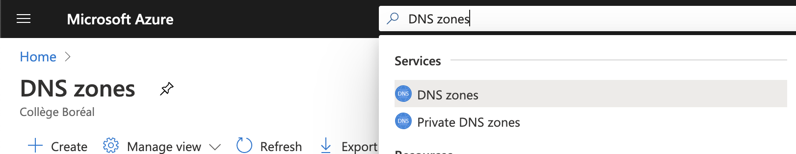
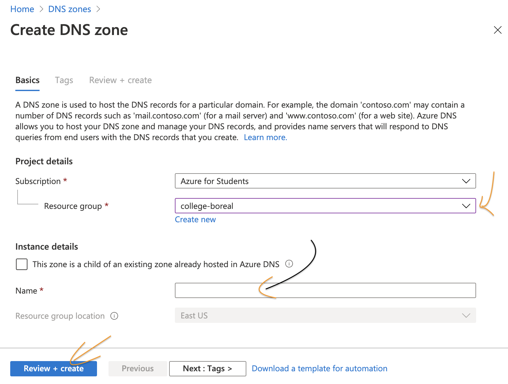
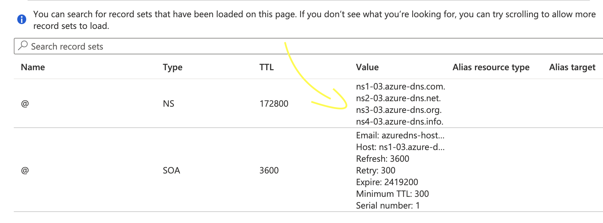

# :three: TLD 

[:tada: Participation](Participation.md)

:zero: Créer votre [Nom de Domaine avec Github Education](https://education.github.com/pack?sort=popularity&tag=Domains)

Sous le panneau de contrôle de votre fournisseur de domaine, rajouter un enregistrement `record` dans la page des `DNS records`.

:one: Exercice `local` 

   Créer un `record` appellé `local` pour associer l'adresse IP `Linux` à votre nom de domaine grace au `control panel` de votre fournisseur

:two: Exercice `Zone DNS`

   Créer une  `DNS zones` sur (i.e. Azure)

- [ ] Localiser le service sur Azure

 </img>

- [ ] Créer la zone DNS avec votre nom de domaine

 </img>

- [ ] Remplacer les serveurs DNS fournit par Azure sur votre fournisseur de nom de domaine

 </img>

# References

#### Pour les noms de domaines

https://www.icann.org/

[TLD - Top Level Domain](https://en.wikipedia.org/wiki/Top-level_domain)

#### Pour les adresses IP

https://afrinic.net/

https://www.arin.net/

https://www.ripe.net/

https://www.apnic.net/

