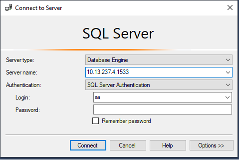
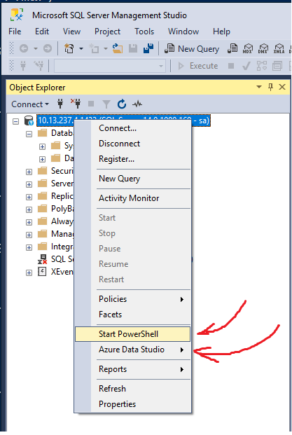
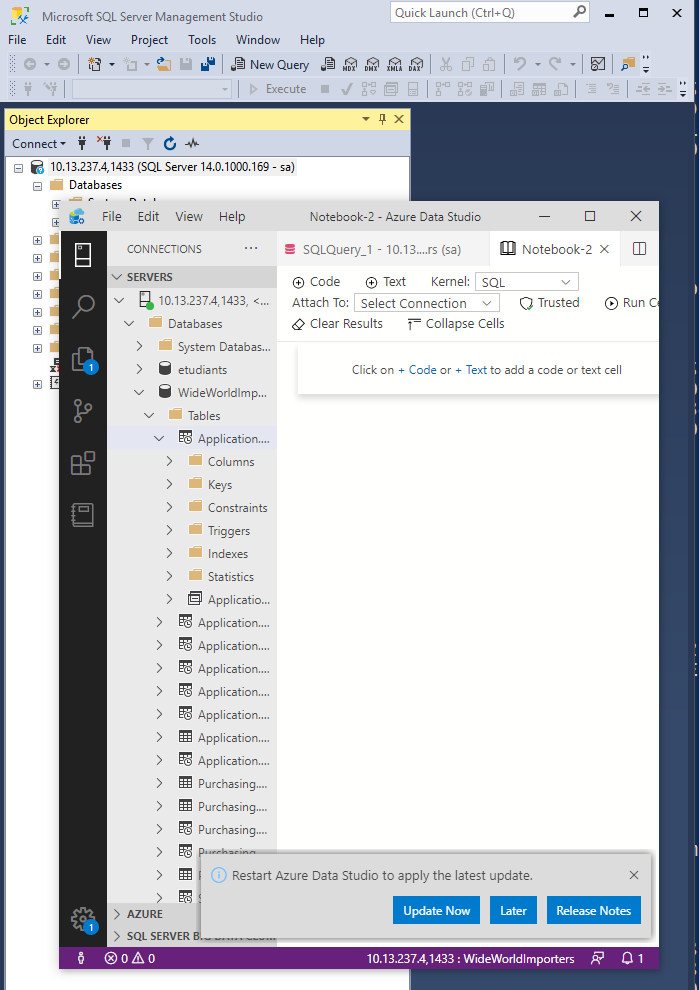
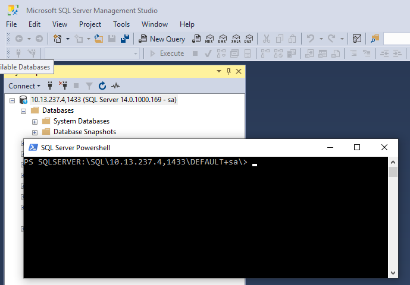

# MS SQL Server

## :a: Création du conteneur MSSQL sur le serveur windows

## :one: Installer Docker Engine pour Windows

### :two: Démarrer le conteneur

```
PS >  docker container run --name some-mssql `
           --env "ACCEPT_EULA=Y" `
           --env "SA_PASSWORD=Password123" `
           --publish 1433:1433 --detach `
           kkbruce/mssql-server-windows-express:windowsservercore-1809
```

### :three: Se connecter au conteneur

```
PS > docker container exec --interactive --tty some-mssql powershell
```


### :four: Utiliser SQL CMD

```
PS > sqlcmd -U sa -P Password123 -S localhost,1433
1> SELECT name FROM master.sys.databases
2> GO
>> list of DBs
1> QUIT
```

## :b: Test visuellement avec SSMS sur votre PC

:pushpin: Install SQL-SERVER Management Studio (SSMS) using `choco` in Admin Level

```
PS > choco install ssms
```

:pushpin: Install Azure Data Studio

```
PS > choco install azure-data-studio
```

:apple: Uniquement

```
$ brew cask install azure-data-studio
```

:pushpin: Installation du module SqlServer pour utiliser les commandes PowerShell dans `SSMS`

https://docs.microsoft.com/en-us/sql/powershell/download-sql-server-ps-module

:star: Installer `SQLServer` CmdLets 

```
PS > Install-Module -Name SqlServer
```

:star: Lister les commandes

```
PS > Get-Module SqlServer -ListAvailable
```

:bulb: Utiliser SQLPS(https://docs.microsoft.com/en-us/sql/powershell/sql-server-powershell)

## :ab: Se connecter à SSMS



:star: Ouvrir SSMS Powershell ou Azure Data Studio

</img>


:star: Utiliser Azure Data Studio

</img>

:star: Utiliser SSMS Powershell

https://www.sqlshack.com/connecting-powershell-to-sql-server/


</img>

:pushpin: Examples 

:star: Voir toutes les bases de données

```
PS> Invoke-Sqlcmd "SELECT DB_NAME() AS DatabaseName"
```

:star: Creer une base de donnees `TestDB`


```
PS> Invoke-Sqlcmd "CREATE DATABASE TestDB;"
```


# References

https://hub.docker.com/r/microsoft/mssql-server-windows-express

https://github.com/pulla2908/docker-mssql-server-windows-developer-fti
