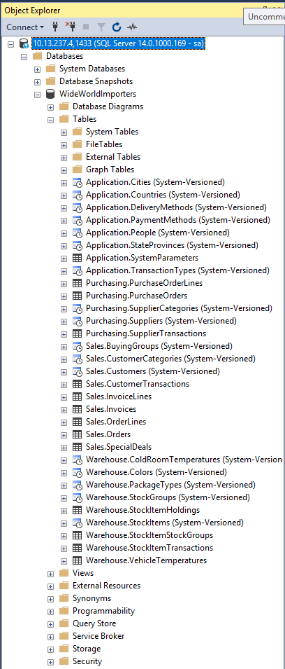

# SSMS PowerShell

## :woman_student: [Participation](.scripts/Participation.md)

## :o: Devoir

           Le but de l'exercice est de créer un plan de maintenance permettant la sauvegarde 
           et la récupération de base de données MSSQL  dans un script Powershell

## Laboratoire : Création d’un plan de maintenance MSSQL

## :o: Sur votre PC, créer votre répertoire de travail dans `git bash` ou dans le `Terminal`

- [ ] Dans le répertoire `4.SSMS-PS` Créer un répertoire avec comme nom, votre :id:

`$ mkdir ` :id:

- [ ] Copier les fichiers se trouvant dans le repretoire `.src` dans votre répertoire

      * incluant les fichier `backup.ps1`  et `restore.ps1`

      * incluant le repertoire `scripts`  comportant les scripts SQL

`$ cp -r .src/* `:id:` `

- [ ] Soumettre votre répertoire de travail vers github `(git add, commit, push)` 

## :a: Dans votre Serveur Windows du laboratoire

:pushpin: Installer `git` sur votre serveur Windows

- [ ] Créer un répertoire `Developer` et y mettre le cours

```
PS > mkdir Developer
```

- [ ] Cloner le cours et aller dans son répertoire de travail :id:

```
PS > git clone https://github.com/CollegeBoreal/INF1089-200-21H-02.git 
```

## :a: Création du container MSSQL

:pushpin: Aller dans le repertoire de son :id: et creer un répertoire `backup` et y mettre le fichier `.gitkeep`

```
PS> mkdir backup
PS> echo $null >> backup\.gitkeep
```

:pushpin: Capturer le répertoire courant `$PWD` et le placer dans la variable d'environnement `$SRC`

```
PS> $SRC = (pwd).Path | Foreach-Object {$_ -replace '\\','/'}
```

:m: Lancer le conteneur avec une gestion d'état `--volume`

:bulb: Le paramètre Docker `--volume` représente l'état à capturer et prend une source et une destination

```
PS >  docker container run --name some-mssql `
           --env "ACCEPT_EULA=Y" `
           --env "SA_PASSWORD=Password123" `
           --volume ${SRC}:C:/DATA `
           --publish 1433:1433 --detach `
           kkbruce/mssql-server-windows-express:windowsservercore-1809
```


## :b: Restore Database

:pushpin: Dans son répertoire de travail (i.e. :id: )

* Lancer son script de restauration

```
PS > .\restore.ps1
```

:pushpin: Vérification dans `SSMS` 

* La base de donnees `WorldWideImporters` a été importée

</img>

## :ab: Backup Database

:pushpin: Dans son répertoire de travail (i.e. :id: )

* Lancer son script de backup

```
PS > .\backup.ps1
```

:pushpin: Vérification

```
PS > gci backup
```

* le fichier `wwwi_2.bak` doit ètre présent 


## :ab: Exemple de Backup et Restore

:pushpin: Avec Docker

https://docs.microsoft.com/en-us/sql/linux/tutorial-restore-backup-in-sql-server-container

:pushpin: Autre plus diffcile

http://www.mikefal.net/2015/10/13/a-month-of-sql-ps-backups-and-restores/


## :bulb: Volumes:

https://github.com/pulla2908/docker-mssql-server-windows-developer-fti

https://hub.docker.com/r/microsoft/mssql-server-windows-developer/


https://github.com/Microsoft/mssql-docker/issues/370
