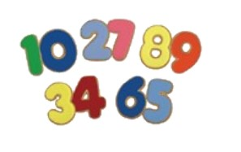
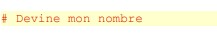
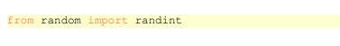

# Devine mon nombre 🥇:
----------------------------------------------

## 💻: Devine mon nombre est jeu 
ce jeu est tres simple. l'ordinateur tire un nombre au hasard en 1 et 30 et vous avez cinq essais pour le trouver. Apres chaque tentative, l'ordinateur vous dira si le nombre que vous avez propose est trop grand, trop petit ou si vous avez le bon nombre.


---------------------------------------------------------

# :one: Code du programme

--------------------------------------------------

```python
# -*- coding: utf-8 -*-
"""
Created on Wed Apr  7 14:43:18 2021

@author: skofo
"""

# Devine mon nombre

from random import randint

nbr_essais_max = 5
nbr_essais = 1
borne_sup = 30
mon_nombre = randint(1,borne_sup)   # nombre choisi par l'ordinateur
ton_nombre = 0                      # nombre proposé par le joueur

print("J'ai choisi un nombre entre 1 et",borne_sup)
print("A vous de le deviner en",nbr_essais_max,"tentatives au maximum !")

while ton_nombre != mon_nombre and nbr_essais <= nbr_essais_max:
    print("Essai no ",nbr_essais)
    ton_nombre = int(input("Votre proposition : "))
    if ton_nombre < mon_nombre:
        print("Trop petit")
    elif ton_nombre > mon_nombre:
        print("Trop grand")
    else:
        print("Bravo ! Vous avez trouvé",mon_nombre,"en",nbr_essais,"essai(s)")
    nbr_essais += 1
        
if nbr_essais>nbr_essais_max and ton_nombre != mon_nombre :
    print("Désolé, vous avez utilisé vos",nbr_essais_max,"essais en vain.")
    print("J'avais choisi le nombre",mon_nombre,".")
    
   ```


-------------------------------------------------------------

# :two: Analyse du programme 


```
ceci est un commentaire. les commentaire n'ot pas d'influence sur le programme lui meme, juste pour aider a la lecture et a la compreheension du code.
```

## :apple: Variable


```
Nous avons ici cinq variables qu'il faut initialiser. Cela signifie qu'il faut leur donner une valeur
de départ. Si on ne le fait pas, l'interpréteur Python va envoyer le message d'erreur.
C'est au moment où l'on initialise une variable que l'interpréteur Python
la crée. On peut voir une variable comme une boîte qui va contenir une
valeur : ce peut être un nombre, une chaîne de caractères, une liste, etc.
Écrire nbr_essais = 1 a pour effet de déposer dans cette boîte la valeur
entière 1. On ne pourra pas mettre autre chose que des nombres entiers dans
cette variable par la suite.
Dans la variable mon_nombre va être stockée une valeur aléatoire entière, qui changera à chaque
exécution du programme. Il est à noter que si l'on avait omis la ligne

```


## :apple: Variable


```
Ces deux lignes écrivent à l'écran le texte entre guillemets, ainsi que les valeurs contenues dans
les variables borne_sup et nbr_essais_max. En l'occurrence, on verra s'écrire sur l'écran :
J'ai choisi un nombre entre 1 et 30
A vous de le deviner en 5 tentatives au maximum !

```


