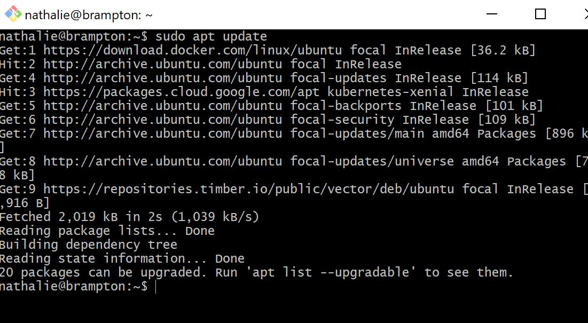

# 👧 Terraform local-exec et remote-exec

Terraform est une plateform qui permet d'exercuter les codes Infracstructures as a service (IAAS). Dans notre travail nous allons installer terraform dans notre serveur ubuntu 20.04.lts. et nous allons installer le local-exec et le remote-exec. Elle nous permettra soit d'exercuter les commandes ou codes localement ou a distance.

:one: ## Installation de terraform

 ✔️ le script schell suivant permet d'installer terraform sur notre machine linux. il suffit de creer un dossier avec le script suivant avec l'extension .sh, puis de l'exercuter. Par exemple avec git bash vous allez taper `./script` et valider pour executer le script. Mais notre cas nous avons voulu installer terraform etape par etape.

```
#!/bin/bash

function terraform-install() {
  [[ -f ${HOME}/bin/terraform ]] && echo "`${HOME}/bin/terraform version` already installed at ${HOME}/bin/terraform" && return 0
  LATEST_URL=$(curl -sL https://releases.hashicorp.com/terraform/index.json | jq -r '.versions[].builds[].url' | egrep 'terraform_[0-9]\.[0-9]{1,2}\.[0-9]{1,2}_linux.*amd64' | sort -V | tail -1)
  curl ${LATEST_URL} > /tmp/terraform.zip
  mkdir -p ${HOME}/bin
  (cd ${HOME}/bin && unzip /tmp/terraform.zip)
  if [[ -z $(grep 'export PATH=${HOME}/bin:${PATH}' ~/.bashrc) ]]; then
  	echo 'export PATH=${HOME}/bin:${PATH}' >> ~/.bashrc
  fi
  
  echo "Installed: `${HOME}/bin/terraform version`"
  
  cat - << EOF 
 
Run the following to reload your PATH with terraform:
  source ~/.bashrc
EOF
}

terraform-install

```
✔️ ## Installation de terraform etape par etape dans notre serveur

 💙 Mettre a jour notre serveur avec la commande `sudo apt update`
 
 
 💙 installer l'application qui va vous permettre de dezipper vos fichiers dans linux si ce n'est pas encore fait avec la commande suivant :
      
      ```
      $ sudo apt -get install wget unzip -y
      
      ```
      Dans mon cas il existe deja dams mon serveur linux.
      
      
      
  💙 Creer un dossier terraform dans votre serveur, puis entre dans le dossier. allez dans le site web de terraform et copier le lien de telechargement de terraform et executer le fichier.
      
      
  💙 Unziper terraform afin de l'exercuter et l'installer
  
        
   
  💙 Maintenant vous pouvez creer un repertoire pour faire vos projets. Pour voir les options des commandes terraform taper `terraform` et appuyer sur enter.
        
        

  💙 Apres installation et apres verification de la version terraform avec la commande `terraform --version` nous avons vue que nous n'avons pas la version ressente alors nous allons l'update. 
  
       
       
   💙 Pour voir ce qu'il ya a l'interieur d'un fichier creer dans terraform, entre dans le fichier et faire la commande `terraform init`
   
       
       
     

