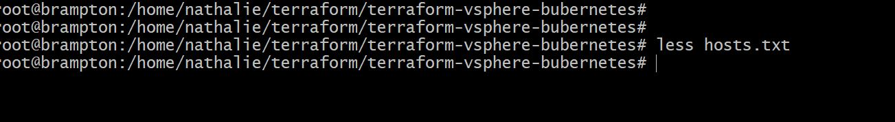
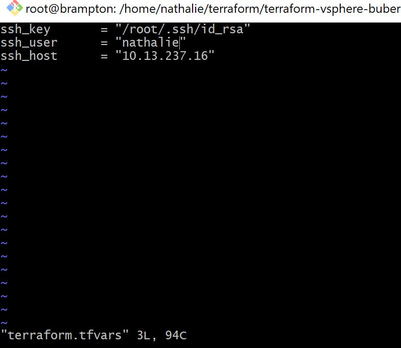
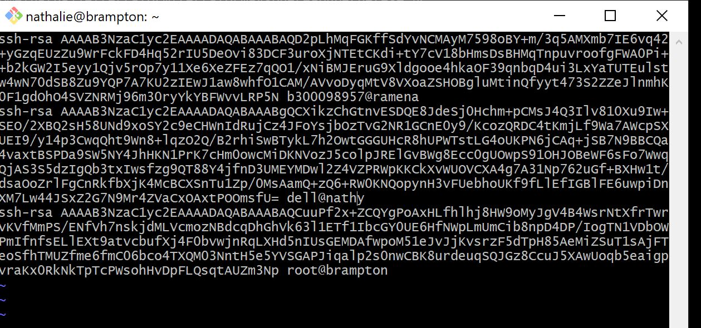

# 👧 Terraform local-exec et remote-exec


Terraform est une plateform qui permet d'exercuter les codes Infracstructures as a service (IAAS). Dans notre travail nous allons installer terraform dans notre serveur ubuntu 20.04.lts. et nous allons installer le local-exec et le remote-exec. Elle nous permettra soit d'exercuter les commandes ou codes localement ou a distance.

:one: ##Installation de terraform

 ✔️ le script schell suivant permet d'installer terraform sur notre machine linux. il suffit de creer un dossier avec le script suivant avec l'extension .sh, puis de l'exercuter. Par exemple avec git bash vous allez taper `./script` et valider pour executer le script. Mais notre cas nous avons voulu installer terraform etape par etape.

```
#!/bin/bash

function terraform-install() {
  [[ -f ${HOME}/bin/terraform ]] && echo "`${HOME}/bin/terraform version` already installed at ${HOME}/bin/terraform" && return 0
  LATEST_URL=$(curl -sL https://releases.hashicorp.com/terraform/index.json | jq -r '.versions[].builds[].url' | egrep 'terraform_[0-9]\.[0-9]{1,2}\.[0-9]{1,2}_linux.*amd64' | sort -V | tail -1)
  curl ${LATEST_URL} > /tmp/terraform.zip
  mkdir -p ${HOME}/bin
  (cd ${HOME}/bin && unzip /tmp/terraform.zip)
  if [[ -z $(grep 'export PATH=${HOME}/bin:${PATH}' ~/.bashrc) ]]; then
  	echo 'export PATH=${HOME}/bin:${PATH}' >> ~/.bashrc
  fi
  
  echo "Installed: `${HOME}/bin/terraform version`"
  
  cat - << EOF 
 
Run the following to reload your PATH with terraform:
  source ~/.bashrc
EOF
}

terraform-install

```
✔️ ## Installation de terraform etape par etape dans notre serveur

 💙 Mettre a jour notre serveur avec la commande `sudo apt update`
 
 
 💙 installer l'application qui va vous permettre de dezipper vos fichiers dans linux si ce n'est pas encore fait avec la commande suivant :
      
      ```
      $ sudo apt-get install wget unzip -y
      ```
      
  Dans mon cas il existe deja dams mon serveur linux.
  
  
      
  💙 Creer un dossier terraform dans votre serveur, puis entre dans le dossier. allez dans le site web de terraform et copier le lien de telechargement de terraform et executer le fichier.
  
   
      
  💙 Unziper terraform afin de l'exercuter et l'installer avec les commandes suivantes :
  
  ```
  
  $ unzip terraform_0014_10_linux_amd.zip
  
  ```
 
  
  ```
  $ sudo snap install --candidate terraform
  
  ```
  
  ou
  
  ```
  
  $ sudo apt install unzip
  
  ````
  
   
   
   
   
   
   
  💙 Maintenant vous pouvez creer un repertoire pour faire vos projets. Pour voir les options des commandes terraform taper `terraform` et appuyer sur enter.
 
 

  💙 Apres installation et apres verification de la version terraform avec la commande `terraform --version` nous avons vue que nous n'avons pas la version ressente alors nous allons l'update. Il est conseiller de se mettre en mode administrateur pour executer les commandes terraform
  
  ```
  sudo -s
  
  ```
  
  ```
  
  # terraform --version
  
  ````
  
   
       
   💙 Pour voir ce qu'il ya a l'interieur d'un fichier creer dans terraform, entre dans le fichier et faire la commande `terraform init` Notre est vide n'esce pas. He bien parce que nous n'avons encore rien mis a l'interieur. 
   
   ```
  # terraform init
   
   ```
       
  
 
  :two: ##Terraform local-exec
  
 Local-exec c'est l'utilisation local sur la machine sur laquelle on travail. cest un provisionner qui permet de lancer localement les commandes local a notre machine terraform.
 
 nous allons creer un fichier terraform `main.tf` et nous allons mettre le code suivant pour l'executer en local. a chaque fois faut preciser dans le code que vous voulez l'executer en local en precisan leprovisioner:
 
 
 ```
 variable "hosts" {
  default   = {
    "10.13.237.16" = "localhost hithub.local"
    "10.13.237.17" = "localhost hithub.local"
    "10.13.237.18" = "localhost hithub.local"
  }
 }
resource "null_resource" "hosts" {
 for_each = var.hosts
 provisioner "local-exec" {
  command = "echo '${each.key} ${each.value}'>> hosts.txt"
 }
}
 ```
 Tapez `vim main.tf` pour creer le fichier main et ecrivez votre code a l'interieur puis tapez `:wq` pour enregistrer
 
 
 
 
 
 Ensuite faite ` terraform init` pour reinitialliser terraform avant d'executer votre commande terraform:
 
 ```
 # terraform init
 
 ```
 
 
 
 `terraform plan` pour voir tous les actions que terrafrom doit faire avec notre commandes.
 
 ```
 # terraform plan
 ```
 
 
 
 `terraform apply` pour executer le code des variables qu'on a creer :
 
 ```
# terraform apply
 
 ```
 
 
 
 Nous pouvons ouvrir notre fichier `hosts.txt` pour voir le resultat du code que nous avons executer 
 avec la commande `less hosts.txt`:
 
 ```
 # less hosts.txt
 
 ```
 
 
 
 
 
 ☑️ nous venons de d'illustrer l'execution d'un code terraform en local-exec. vous pouvez ameliorer votre code avec la commande `triggers` pour que a l'executer terraform prend en consideration toutes les modifications que vous ferrez a votre code.
 
 :three: ##Terraform remote-exec / ssh
 
 pour le faire nous allons creer un local-exec distant, declarer une ressource, decrarer une connection, declarer le provisionner de type remote-exec avec la clause inline qui va permettre de declarer le code que l'on souhaite executer nous allons installer `nginx` sous terraform. Pour le faire nous devons creer un fichier terraform `mains.tf` et mettre la commande suivante a l'interieur.
 
 ```
variable "ssh_host" {}
variable "ssh_user" {}
variable "ssh_key" {}
resource "null_resource" "ssh_target" {
  connection {
    type        = "ssh"
    user        = var.ssh_user
    host        = var.ssh_host
    private_key = file(var.ssh_key)
  }
  provisioner "remote-exec" {
    inline = [
      "sudo apt update -qq >/dev/null",
      "sudo apt install -qq -y nginx >/dev/null"
    ]
  }
}


 ```
 


Avant d'executer notre commande nous devons d'abord creer une cles ssh a notre user

```
# ssh-keygen -b 2048

```


Notre cles a ete sauvegarder `/root/.ssh/id_rsa`

nous allons creer un dossier terraform pour regrouper les variables :

```
# vim terraform.tfvars

```
[image](images/22.JPG)
```
ssh_key       = "/root/.ssh/id_rsa"
ssh_user      = "nathalie"
ssh_host      = "10.13.237.16"
```



Nous pouvons verifer si nous avons ngnix dans notre serveur

```
#  service nginx status

```


Commencer a executer votre fichier `mains.tf`

```
# terraform init
```


Ensuite terraform plam

```
# terraform plan
```

 
Maintenant on va le lance aavec un terraform apply, mais avant de faire terraform apply rassurer vous de copiez votre cles public du serveur dans votre machine local.

```
# cat ~/.ssh/id_rsa.pub
```


cette commande va vous generer votre cles public alors copiez le dans votre machine local dans le dossier suivant:

```
vim .ssh/authorized_keys
```



```
# terraform apply#

```


Nous avons reussit a installer ngix avec le provisionner remote-exec Youpi!!!!!!!!!!!!!!!!!!!!!!!

Apres cela verifier l'installation de nginx avec :

```
# service nginx status

```


vous pouvez utiliser les commande systemctl pour activer nginx.

Nous arrivons donc au terme de notre travail. Bonne lecture

References :
https://www.terraform.io/docs/language/resources/provisioners/remote-exec.html
https://gitlab.com/xavki/sommaire-xavki-tutos-fr/-/tree/master


 
