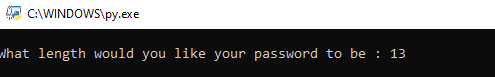
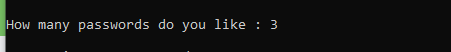
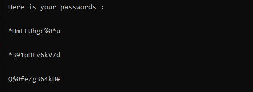

#  :round_pushpin: Script Python Permettant de Générer les Mots de Passe :snake:

`#!/usr/bin/python

import random 

chars = "abcdefghijklmnopqrstuvwxyzABCDEFGHIJKLMNOPQRSTUVWXYZ1234567890!@#$%^&*"

while 1:
  
#Raw_input asking for user input to return as a strings

	print(" ")
	password_length = int(input('What length would you like your password to be : '))
	print(" ")
	password_count = int(input('How many passwords do you like : '))
	print(" ")
	print ("  Here is your passwords : ")
	print (" ")

#Saying the script to run 'x' number of times base on the length the password should be

	for x in range (0, password_count):
		password = ""
		for x in range(0, password_length):

#creating the password from 

			password_char = random.choice(chars)
			password = password + password_char
		print (" ")
		print (" ", password)
		print (" ")`

## :white_check_mark: Nombre de caractère que vous voulez pour vos ` Mots de passe `

## :white_check_mark: Le nombre de ` Mots de passe ` que vous voulez

## :tada: Vous avez vos ` Mots de passe `

