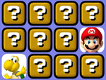
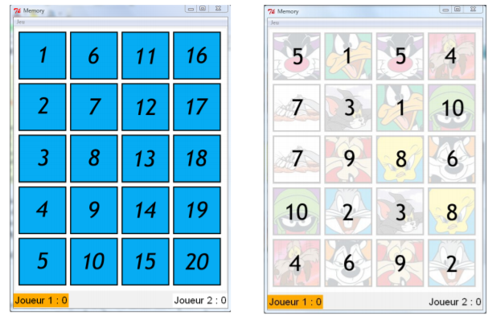
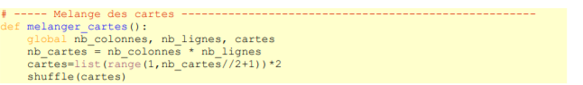
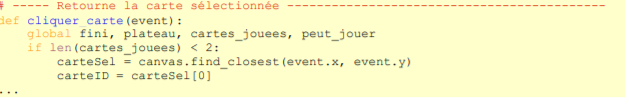
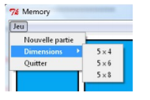
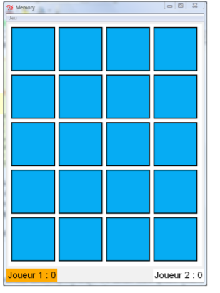

# Memory :book:
----------------------------------------------

## :heart: Memory est un jeu de société basé sur la mémoire édité pour la première fois par Ravensburger
en 1959. Il se joue avec un certain nombre de paires de cartes identiques. Les cartes sont toutes
retournées sur le plateau. Ensuite, à son tour, chaque joueur retourne deux cartes de son choix. Si les
cartes sont identiques, il les ramasse et rejoue. Sinon, les cartes sont retournées face cachée à leur
emplacement initial. Le jeu se termine quand toutes les cartes ont été ramassées et le gagnant est
celui qui a ramassé le plus de cartes.



---------------------------------------------------------

# :one: Code du programme

--------------------------------------------------

```python
# Memory pour 2 joueurs humains
from tkinter import *
from random import randint, shuffle
# ----- variables globales --------------------------------------------------------
images = [] # contient les liens aux fichiers images
cartes = [] # contient le lien vers l'image des différentes cartes
cartes_jouees = [] # contient les cartes jouées
nb_lignes, nb_colonnes = 5, 4
joueur_actuel = 0
score = [0,0]
fini = False
peut_jouer = True
# ----- Images --------------------------------------------------------------------
def charger_images():
 del images[:] # vide la liste
 nb_images = 21 # l'image no 0 est le dos des cartes
 choixCartes = []
 choixCartes.append(0)
 ```
 
 
 ```pyhon
 i=0
 while i < nb_images-1: # tirage au sort des cartes à utiliser
 x = randint(1, nb_images-1)
 if x not in choixCartes:
 choixCartes.append(x)
 i += 1
 for i in range(nb_images): # importation des images
 nom = 'carte-' + str(choixCartes[i]) + '.gif'
 image = PhotoImage(file = nom)
 images.append(image)
# ----- Melange des cartes -----------------------------------------------------
def melanger_cartes():
 global nb_colonnes, nb_lignes, cartes
 nb_cartes = nb_colonnes * nb_lignes
 cartes=list(range(1,nb_cartes//2+1))*2
 shuffle(cartes)
 ```
 
```python
 
# ----- Retourne les deux cartes à la fin de la sélection ----------------------
def gerer_tirage():
 global nb_colonnes, nb_lignes, cartes_jouees
 global joueur_actuel, fini, peut_jouer
 if cartes[cartes_jouees[0]-1] == cartes[cartes_jouees[1]-1]:
 ```
 
```python
 # enlève les cartes identiques. Le joueur actuel reste le même
 canvas.delete(cartes_jouees[0])
 canvas.delete(cartes_jouees[1])
 score[joueur_actuel] += 1
 else:
 # retourne les cartes différentes. Le joueur actuel change
 canvas.itemconfig(cartes_jouees[0], image = images[0])
 canvas.itemconfig(cartes_jouees[1], image = images[0])
 joueur_actuel = (joueur_actuel+1)%2 # la main passe à l'autre joueur
 cartes_jouees = []
 text1 = 'Joueur 1 : ' + str(score[0]*2)
 text2 = 'Joueur 2 : ' + str(score[1]*2)
 points_joueur1.config(text = text1)
 points_joueur2.config(text = text2)
 peut_jouer = True # réactive l'effet du clic de la souris
 if joueur_actuel == 0: # celui qui joue est en orange
 points_joueur1.config(bg = 'orange')
 points_joueur2.config(bg = 'white')
 else:
 points_joueur2.config(bg = 'orange')
 points_joueur1.config(bg = 'white')
 if score[0] + score[1] == (nb_colonnes*nb_lignes)//2:
 fini = True # afficher le résultat de la partie
 if score[0] > score[1]:
 texte = "Le joueur 1 a gagné !"
 elif score[0] < score[1]:
 texte = "Le joueur 2 a gagné !"
 else:
 texte = "Egalité !"
 canvas.create_rectangle(0,0,(110*nb_colonnes)+20,(110*nb_lignes)+20,
 fill='white')
 canvas.create_text((55*nb_colonnes)+10,(55*nb_lignes)+10,
 text=texte,font='Calibri 24',fill='black')
``` 
 
```python
# ----- Retourne la carte sélectionnée -------------------------------------------
def cliquer_carte(event):
 global fini, plateau, cartes_jouees, peut_jouer
 if len(cartes_jouees) < 2:
 carteSel = canvas.find_closest(event.x, event.y)
 carteID = carteSel[0]
 if fini:
 fini = False
 reinit()
 else:
 canvas.itemconfig(carteID, image = images[cartes[carteID-1]])
 if len(cartes_jouees) == 0:
 cartes_jouees.append(carteID) # enregistre la carte jouée
 elif carteID != cartes_jouees[0]: # ne pas cliquer 2x sur la même carte
 cartes_jouees.append(carteID)
 
 ```
 if peut_jouer and len(cartes_jouees) == 2:
 peut_jouer = False # désactive l'effet du clic de la souris
 plateau.after(1500,gerer_tirage) # patiente 1,5 secondes
 
 ```
# ----- Change la taille du plateau de jeu --------------------------------------
def jeu5x4():
 global nb_colonnes
 nb_colonnes = 4
 reinit()
def jeu5x6():
 global nb_colonnes
 nb_colonnes = 6
 reinit()
def jeu5x8():
 global nb_colonnes
 nb_colonnes = 8
 reinit()
 
```

```python
 
# ----- création des menus et sous-menus ------------------------------------------
def creer_menus(fen):
 top = Menu(fen)
 fen.config(menu=top)
 jeu = Menu(top, tearoff=False)
 top.add_cascade(label='Jeu', menu=jeu)
 jeu.add_command(label='Nouvelle partie', command=reinit)
 submenu=Menu(jeu, tearoff=False)
 jeu.add_cascade(label='Dimensions', menu=submenu)
 submenu.add_command(label='5 x 4', command=jeu5x4)
 submenu.add_command(label='5 x 6', command=jeu5x6)
 submenu.add_command(label='5 x 8', command=jeu5x8)
 jeu.add_command(label='Quitter', command=fen.destroy)
 
```

```python
# ----- Création du canvas --------------------------------------------------------
def creer_canevas(fen, col, lig):
 return Canvas(fen, width=(110*col)+10, height=(110*lig)+10, bg='white')
 ```
 
 ```python
 
# ----- Modifier le canvas --------------------------------------------------------

# Redémarre une partie et change éventuellement la difficulté
def reinit():
 global canvas, joueur_actuel, score, nb_lignes, nb_colonnes
 joueur_actuel = 0
 score =[0,0]
 del cartes[:]
 del cartes_jouees[:]
 canvas.destroy()
 canvas = creer_canevas(plateau, nb_colonnes, nb_lignes)
 canvas.pack(side = TOP, padx = 5, pady = 5)
 canvas.bind("<Button-1>", cliquer_carte) # permet le clic sur les cartes
 melanger_cartes()
 for i in range(nb_colonnes): # dessin des cartes retournées
 for j in range(nb_lignes):
 canvas.create_image((110*i)+60, (110*j)+60, image=images[0])
 text1 = 'Joueur 1 : ' + str(score[0]*2)
 text2 = 'Joueur 2 : ' + str(score[1]*2)
 points_joueur1.config(text = text1, bg = 'orange')
 points_joueur2.config(text = text2, bg = 'white')
 
```

```python
 
# ----- Programme principal -------------------------------------------------------
fenetre = Tk()
fenetre.title("Memory")
creer_menus(fenetre)
# création du canvas dont la taille dépend du nombre de cartes
plateau = Frame(fenetre)
plateau.pack()
```


-------------------------------------------------------------

# :two: les cartes et leur emplacements :card:

Dans ce programme, il ne faut pas confondre une carte et l'image qui y est représentée. Les cartes
peuvent être considérées comme les emplacements indiqués sur la figure de gauche ci-dessous



-------------------------------------------------------

À ces emplacements se trouvent les images (figure de droite ci-dessus).
Le jeu peut être représenté par une liste. Pour l'exemple ci-dessus, la liste serait :
cartes = [5, 7, 7, 10, 4, 1, 3, 9, 2, 6, 5, 1, 8, 3, 9, 4, 10, 6, 8, 2].
N'oubliez pas que les rangs d'une liste sont numérotés à partir de 0. Donc, pour savoir quelle
image se cache sous la carte no 4, il faut afficher cartes[3]. Le résultat est 10

# Exemple de mélange 
Avant : [1, 2, 3, 4, 5, 6, 7, 8, 9, 10, 1, 2, 3, 4, 5, 6, 7, 8, 9, 10]
Après : [5, 7, 7, 10, 4, 1, 3, 9, 2, 6, 5, 1, 8, 3, 9, 4, 10, 6, 8, 2]

```python
# ----- Melange des cartes -----------------------------------------------------
def melanger_cartes():
 global nb_colonnes, nb_lignes, cartes
 nb_cartes = nb_colonnes * nb_lignes
 cartes=list(range(1,nb_cartes//2+1))*2
 shuffle(cartes)
 ```



---------------------------------------------------------

# :three: Cartes jouées :game_die:

Les cartes choisies alternativement par les joueurs (humain ou cybernétique) seront stockées dans
la liste cartes_jouees, qui contiendra toujours 2 nombres entiers.
Ces nombres indiquent les emplacements des cartes. Pour connaître l'image de la première carte
choisie, il faut afficher cartes[cartes_jouees[0]].

-------------------------------------------------------------------------

# :four: Analyse du programme

Voyons maintenant plus en détails les nouveautés de ce programme.
## Quelle carte a été cliquer :exclamation:



La méthode find_closest() renvoie le numéro de l'objet le plus proche des coordonnées de la
souris au moment du clic. Le résultat sera un tuple. Par exemple, le résultat (2,) indiquera la carte no2. L'identifiant de la carte sera donc le premier élément du tuple. Voilà l'explication de la ligne

```python
carteID = carteSel[0]
````
Il est donc possible de cliquer à côté d'une carte. Ce sera la carte la plus proche qui sera
retournée.

# :five: Menus

```python
# ----- création des menus et sous-menus ------------------------------------------
def creer_menus(fen):
 top = Menu(fen)
 fen.config(menu=top)
 jeu = Menu(top, tearoff=False)
 top.add_cascade(label='Jeu', menu=jeu)
 jeu.add_command(label='Nouvelle partie', command=reinit)
 submenu=Menu(jeu, tearoff=False)
 jeu.add_cascade(label='Dimensions', menu=submenu)
 submenu.add_command(label='5 x 4', command=jeu5x4)
 submenu.add_command(label='5 x 6', command=jeu5x6)
 submenu.add_command(label='5 x 8', command=jeu5x8)
 jeu.add_command(label='Quitter', command=fen.destroy
 
 ```


------------------------------------------------------------------------------
## Voici à quoi ressemblera la barre de menus :



Le widget Menu permet de créer une barre de menus dans une fenêtre. Pour cela, vous devez tout
d'abord définir un premier menu dans une fenêtre :

```python
top = Menu(fen)
```
puis associer ce menu à la fenêtre :
```
fen.config(menu=top)
```
Pour ajouter des menus à la barre de menus, vous créerez de nouveaux menus ayant pour parent
le premier menu créé. Ils seront insérés dans la barre par la fonction add_cascade() :
```python
jeu = Menu(top, tearoff=False)
 top.add_cascade(label='Jeu', menu=jeu)
 ```
 
 La fonction add_cascade() peut recevoir une liste de paramètres dont les principaux sont
label pour indiquer le titre du menu fils et menu représentant l'identifiant du menu fils en question.
Pour ajouter des options à un menu fils, vous utilisez la fonction add_command() dont les
principaux paramètres sont label pour le nom du sous-menu et command qui représente la fonction
associée au clic sur l'option.

```python
jeu.add_command(label='Nouvelle partie', command=reinit)
 jeu.add_command(label='Quitter', command=fen.destroy)
 ```
 
 Pour ajouter des sous-menus, on utilisera à nouveau la fonction add_cascade() :
 ```python
  submenu=Menu(jeu, tearoff=False)
 jeu.add_cascade(label='Dimensions', menu=submenu)
 submenu.add_command(label='5 x 4', command=jeu5x4)
 submenu.add_command(label='5 x 6', command=jeu5x6)
 submenu.add_command(label='5 x 8', command=jeu5x8)
 
 ```
 
---------------------------------------------------------------------

# :six: Fenêtre , Frame, Canvas et Label :rainbow:

```pyhton

 # ----- Création du canvas --------------------------------------------------------
def creer_canevas(fen, col, lig):
 return Canvas(fen, width=(110*col)+10, height=(110*lig)+10, bg='white')
...
# ----- Programme principal -------------------------------------------------------
fenetre = Tk()
fenetre.title("Memory")
creer_menus(fenetre)

```
----------------------------------------------------------------

# Frames :framed_picture:

Un frame est une surface
rectangulaire dans la fenêtre, où l'on peut disposer
d'autres widgets. C'est le conteneur par excellence.
Cette surface peut être colorée et aussi décorée
d'une bordure.

```python
plateau = Frame(fenetre)
plateau.pack()
```


--------------------------------------------------------------

# REFERENCES :computer:

https://www.apprendre-en-ligne.net/pj/

https://www.apprendre-en-ligne.net/pj/memory/index.html

https://www.apprendre-en-ligne.net/pj/memory/memory.py

https://www.apprendre-en-ligne.net/pj/memory/memory.py


