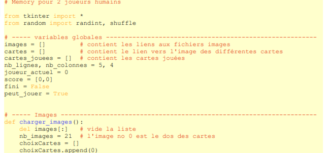
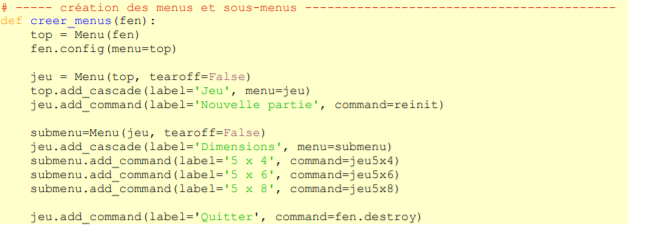

# Memory :book:
----------------------------------------------

## :heart: Memory est un jeu de société basé sur la mémoire édité pour la première fois par Ravensburger
en 1959. Il se joue avec un certain nombre de paires de cartes identiques. Les cartes sont toutes
retournées sur le plateau. Ensuite, à son tour, chaque joueur retourne deux cartes de son choix. Si les
cartes sont identiques, il les ramasse et rejoue. Sinon, les cartes sont retournées face cachée à leur
emplacement initial. Le jeu se termine quand toutes les cartes ont été ramassées et le gagnant est
celui qui a ramassé le plus de cartes.


---------------------------------------------------------

# :one: Code du programme

--------------------------------------------------




-------------------------------------------------------------

# :two: les cartes et leur emplacements :card:

Dans ce programme, il ne faut pas confondre une carte et l'image qui y est représentée. Les cartes
peuvent être considérées comme les emplacements indiqués sur la figure de gauche ci-dessous.

-------------------------------------------------------------------


-------------------------------------------------------

À ces emplacements se trouvent les images (figure de droite ci-dessus).
Le jeu peut être représenté par une liste. Pour l'exemple ci-dessus, la liste serait :
cartes = [5, 7, 7, 10, 4, 1, 3, 9, 2, 6, 5, 1, 8, 3, 9, 4, 10, 6, 8, 2].
N'oubliez pas que les rangs d'une liste sont numérotés à partir de 0. Donc, pour savoir quelle
image se cache sous la carte no 4, il faut afficher cartes[3]. Le résultat est 10

# Exemple de mélange 
Avant : [1, 2, 3, 4, 5, 6, 7, 8, 9, 10, 1, 2, 3, 4, 5, 6, 7, 8, 9, 10]
Après : [5, 7, 7, 10, 4, 1, 3, 9, 2, 6, 5, 1, 8, 3, 9, 4, 10, 6, 8, 2]


---------------------------------------------------------

# : three: Cartes jouées :game_die:

Les cartes choisies alternativement par les joueurs (humain ou cybernétique) seront stockées dans
la liste cartes_jouees, qui contiendra toujours 2 nombres entiers.
Ces nombres indiquent les emplacements des cartes. Pour connaître l'image de la première carte
choisie, il faut afficher cartes[cartes_jouees[0]].

-------------------------------------------------------------------------

# :four: Analyse du programme

Voyons maintenant plus en détails les nouveautés de ce programme.
## Quelle carte a été cliquer :exclamation:


La méthode find_closest() renvoie le numéro de l'objet le plus proche des coordonnées de la
souris au moment du clic. Le résultat sera un tuple. Par exemple, le résultat (2,) indiquera la carte no2. L'identifiant de la carte sera donc le premier élément du tuple. Voilà l'explication de la ligne

```
carteID = carteSel[0]
````
Il est donc possible de cliquer à côté d'une carte. Ce sera la carte la plus proche qui sera
retournée.

# :five: Menus



------------------------------------------------------------------------------
## Voici à quoi ressemblera la barre de menus :


Le widget Menu permet de créer une barre de menus dans une fenêtre. Pour cela, vous devez tout
d'abord définir un premier menu dans une fenêtre :

```
top = Menu(fen)
```
puis associer ce menu à la fenêtre :
```
fen.config(menu=top)
```
Pour ajouter des menus à la barre de menus, vous créerez de nouveaux menus ayant pour parent
le premier menu créé. Ils seront insérés dans la barre par la fonction add_cascade() :
```
jeu = Menu(top, tearoff=False)
 top.add_cascade(label='Jeu', menu=jeu)
 ```
 
 La fonction add_cascade() peut recevoir une liste de paramètres dont les principaux sont
label pour indiquer le titre du menu fils et menu représentant l'identifiant du menu fils en question.
Pour ajouter des options à un menu fils, vous utilisez la fonction add_command() dont les
principaux paramètres sont label pour le nom du sous-menu et command qui représente la fonction
associée au clic sur l'option.

```
jeu.add_command(label='Nouvelle partie', command=reinit)
 jeu.add_command(label='Quitter', command=fen.destroy)
 ```
 
 Pour ajouter des sous-menus, on utilisera à nouveau la fonction add_cascade() :
 ```
  submenu=Menu(jeu, tearoff=False)
 jeu.add_cascade(label='Dimensions', menu=submenu)
 submenu.add_command(label='5 x 4', command=jeu5x4)
 submenu.add_command(label='5 x 6', command=jeu5x6)
 submenu.add_command(label='5 x 8', command=jeu5x8)
 
 ```
 
---------------------------------------------------------------------

# :six: Fenêtre , Frame, Canvas et Label :rainbow:

```

 # ----- Création du canvas --------------------------------------------------------
def creer_canevas(fen, col, lig):
 return Canvas(fen, width=(110*col)+10, height=(110*lig)+10, bg='white')
...
# ----- Programme principal -------------------------------------------------------
fenetre = Tk()
fenetre.title("Memory")
creer_menus(fenetre)

```
----------------------------------------------------------------

# Frames :framed_picture:

Un frame est une surface
rectangulaire dans la fenêtre, où l'on peut disposer
d'autres widgets. C'est le conteneur par excellence.
Cette surface peut être colorée et aussi décorée
d'une bordure.

```
plateau = Frame(fenetre)
plateau.pack()
```


 


