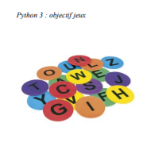
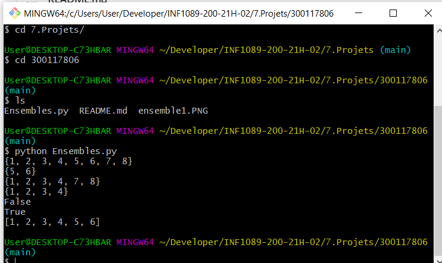
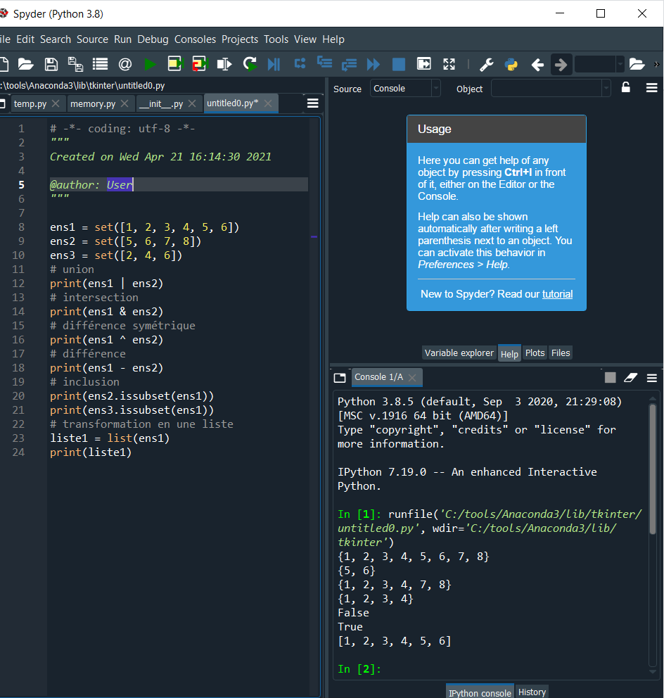
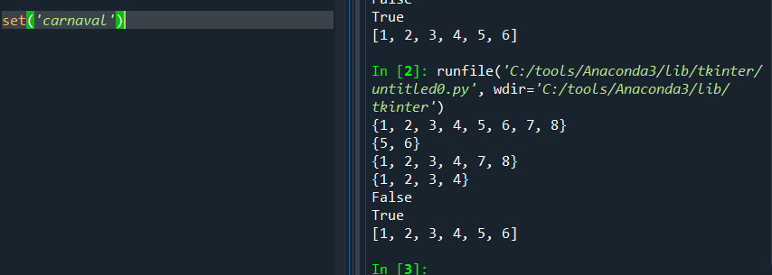

# :rose:Ensembles:one:

Les ensembles en Python sont les mêmes ensembles qu'en mathématiques. On peut leur appliquer
les mêmes opérations : union, intersection, différence symétrique, différence. On peut aussi tester si un ensemble est inclus dans un autre.
Voici un programme qui résume toutes ces opérations.




# Code du programme:rainbow:

```python
ens1 = set([1, 2, 3, 4, 5, 6])
ens2 = set([5, 6, 7, 8])
ens3 = set([2, 4, 6])
# union
print(ens1 | ens2)
# intersection
print(ens1 & ens2)
# différence symétrique
print(ens1 ^ ens2)
# différence
print(ens1 - ens2)
# inclusion
print(ens2.issubset(ens1))
print(ens3.issubset(ens1))
# transformation en une liste
liste1 = list(ens1)
print(liste1)
```
--------------------------------------------------------------------------------

# Exécutions dans Bash




##Voici le résultat de ce programme:two:

```python
{1, 2, 3, 4, 5, 6, 7, 8}
{5, 6}
{1, 2, 3, 4, 7, 8}
{1, 2, 3, 4}
False
True
[1, 2, 3, 4, 5, 6]

```



# Remarquez que dans un ensemble, chaque élément n'apparaît qu'une seule fois:three: 

Notons enfin que l'on peut facilement convertir une chaîne de caractères en un ensemble:

```python
set('carnaval')
```
retournera l'ensemble : {'l', 'n', 'a', 'c', 'v', 'r'}



Vous avez vu que l'on peut manipuler des ensembles (set) comme en mathématiques. Les
ensembles sont parfois pratiques, notamment pour éliminer des doublons.


# REFERENCES:computer:


https://www.apprendre-en-ligne.net/pj/pendu/index.html
