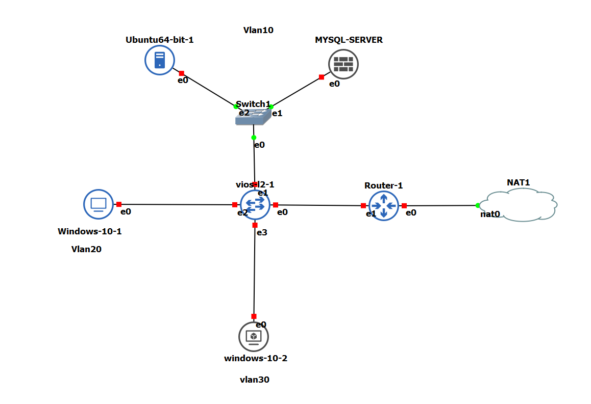

# :zap: How to configure our network using python scripts:zap: 
:star: in this project I will show you how to use python script to configure your router on a Stick and your vlans on your switch and put all interfaces on the right vlans. 


## :zap: This is our topology :zap:
:star: we will use one router and one switch with three vlans and each vlan will receive IP address directly from DHCP server configured on my router.



#  :pushpin: I will start with my router:


## :one: Enabling and configuring our interfaces:     

```

tn.write(b'interface g0/1\n')
time.sleep(2)
tn.write(b'no shutdown\n')
time.sleep(2)

tn.write(b'exit\n')

tn.write(b'interface g0/1.10\n')
time.sleep(2)
tn.write(b'encapsulation dot1Q 10\n')
time.sleep(2)
tn.write(b'ip address 192.168.10.254 255.255.255.0\n')
time.sleep(2)
tn.write(b'no shutdown\n')
time.sleep(2)
tn.write(b'exit\n')

tn.write(b'interface g0/1.20\n')
time.sleep(2)
tn.write(b'encapsulation dot1Q 20\n')
time.sleep(2)
tn.write(b'ip address 192.168.20.254 255.255.255.0\n')
time.sleep(2)
tn.write(b'no shutdown\n')
time.sleep(2)
tn.write(b'exit\n')

tn.write(b'interface g0/1.30\n')
time.sleep(2)
tn.write(b'encapsulation dot1Q 30\n')
time.sleep(2)
tn.write(b'ip address 192.168.30.254 255.255.255.0\n')
time.sleep(2)
tn.write(b'no shutdown\n')
time.sleep(2)
tn.write(b'exit\n')
```
