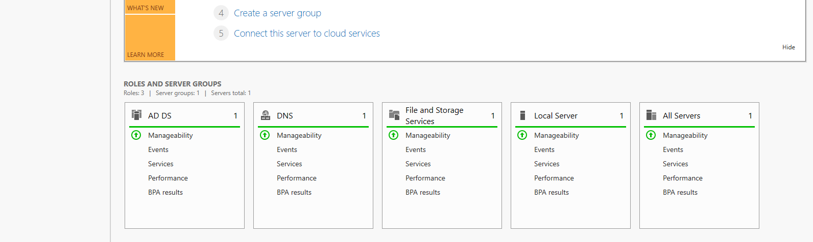
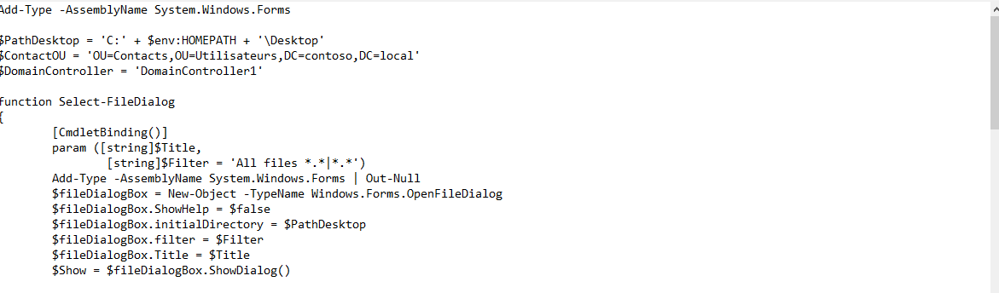
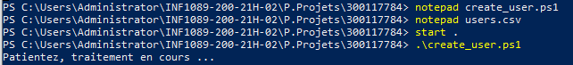
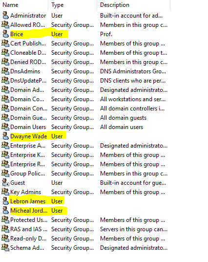

# :rainbow: CREATION DES UTILISATEURS DANS ACTIVE DIRECTORY AUTOMATIQUEMENT A L'AIDE D'UN SCRIPT POWERSHELL

## :one: Installation d'Active Directory et un Domain Controller 
```
Il faut au prealable installer Active Directory et un Domaine Controller sur notre server Windows 
```


-----

## :two: Execution du script 



----


----


## :three: VERIFICATION DE L'EXCUTION DU SCRIPT POWERSHELL




# :rainbow:   FIN       :rainbow:             :rainbow:
